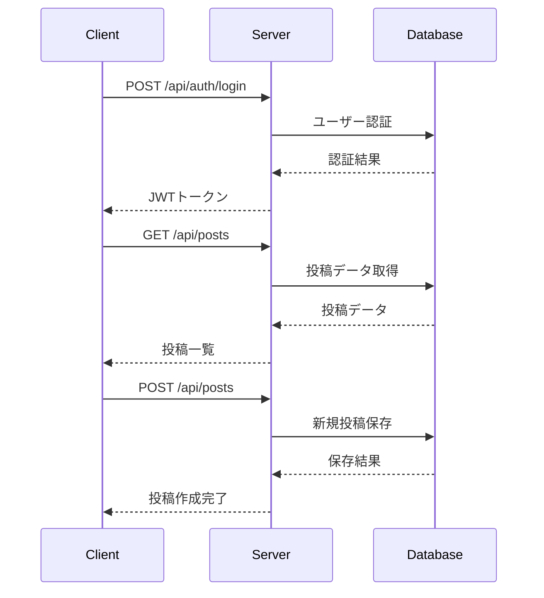

# ElysiaJS CMS

軽量な CMS API の ElysiaJS 実装です。Bun ランタイムと Prisma ORM を使用しています。

## 機能

- コンテンツの作成、読み取り、更新、削除（CRUD）
- ユーザー認証（JWT）
- コンテンツタイプの管理
- ファイルアップロード機能（画像サムネイル生成も対応）
- API ドキュメント（Swagger UI）
- データベース（SQLite）
- 自動テストとCI/CD統合

## 始め方

### 前提条件

- [Bun](https://bun.sh/) がインストールされていること

### インストール

```bash
# リポジトリをクローン
git clone https://github.com/YunosukeYoshino/elysiajs-demo.git
cd elysiajs-demo

# 依存関係をインストール
bun install

# データベースをセットアップ
bun prisma generate
bun prisma migrate dev --name init

# シードデータを挿入 (オプション)
bun seed
```

### 開発サーバーの起動

```bash
bun dev
```

サーバーは http://localhost:3000 で実行されます。

Swagger UI は http://localhost:3000/swagger で確認できます。

## API エンドポイント

### コンテンツ管理

- `GET /api/posts` - すべての投稿を取得
- `GET /api/posts/:id` - IDで投稿を取得
- `POST /api/posts` - 新しい投稿を作成
- `PUT /api/posts/:id` - 投稿を更新
- `DELETE /api/posts/:id` - 投稿を削除

### 認証

- `POST /api/auth/login` - ログイン（JWT トークンを取得）
- `POST /api/auth/register` - 新規ユーザー登録

### ファイル管理

- `POST /api/files/upload` - ファイルをアップロード
- `GET /api/files` - ファイル一覧を取得
- `GET /api/files/:id` - 特定のファイル情報を取得
- `DELETE /api/files/:id` - ファイルを削除

## シーケンス図

以下は主要なAPIの処理フローを示すシーケンス図です。



## テストとCI/CD

### テスト実行

```bash
# テスト用データベースの準備
bun run prepare-db:test

# テストの実行
bun test

# カバレッジ付きテスト
bun test --coverage

# テストを監視モードで実行
bun test --watch
```

### コードスタイル

```bash
# コードフォーマット
bun run format

# リンター実行
bun run lint

# リンター問題自動修正
bun run lint:fix
```

### CI/CD 設定

GitHub Actions を使用した継続的インテグレーション設定例:

```yaml
name: CI

on:
  push:
    branches: [main]
  pull_request:
    branches: [main]

jobs:
  test:
    runs-on: ubuntu-latest

    steps:
      - uses: actions/checkout@v4

      - name: Setup Bun
        uses: oven-sh/setup-bun@v1
        with:
          bun-version: latest

      - name: Install dependencies
        run: bun install

      - name: Run Formatter Check
        run: bun run format --check

      - name: Run Linter Check
        run: bun run lint

      - name: Setup test database
        run: bun run prepare-db:test

      - name: Run tests
        run: bun test

      - name: Run tests with coverage
        run: bun test --coverage
```

## テクノロジースタック

- [ElysiaJS](https://elysiajs.com/) - 高速かつ型安全な Web フレームワーク
- [Bun](https://bun.sh/) - JavaScript/TypeScript ランタイム
- [Prisma](https://www.prisma.io/) - 次世代 ORM
- [JWT](https://jwt.io/) - JSON Web Token 認証
- [SQLite](https://www.sqlite.org/) - 軽量データベース
- [Sharp](https://sharp.pixelplumbing.com/) - 画像処理ライブラリ
- [Biome](https://biomejs.dev/) - リンター・フォーマッター

